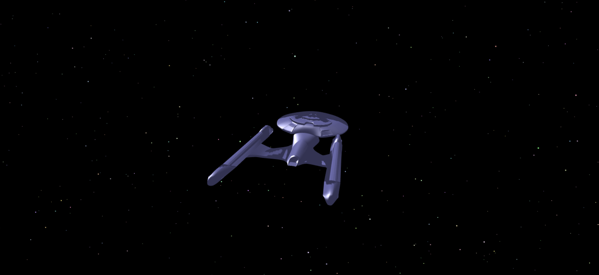

# Spaceship

A series of affine transfomrations applied to keypress and mouseclick/mouseover events that steers a 3D spacehip and moves the camera such that the spaceship is observed from multiple directions.

##### Video Demo:  
  

<pre>
Key events:

- 'F'           increases the velocity of the spaceship in the z-direction (forward) 
- 'S'           decreases the velocity of the spaceship in the z-direction (forward)
- 'Space Bar'   resets the camera position to original location (0, 0, -5)
- 'X'           resets the spaceship's position to original location (0, 0, 0)

Mouse Events:

- 'Left Click'  enables the camera to move from its current position
- 'Mouse Over'  moves the camera in the direction of the mouse's current location on the browser window.

</pre>
